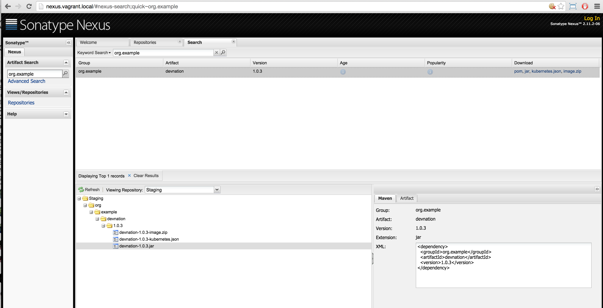

# Demo scenario

Here is the description/presentation of the steps to be followed in order to setup the environment and run the demo

* Install the Openshift Client on your MacosX machine (TODO)

>> * Verify that the `/etc/hosts` file contains a mapping between the IP address of the VM and these hostnames
>> 
>> ```
>> 172.28.128.4	fabric8.local gogs.local vagrant.local docker-registry.vagrant.local fabric8-master.vagrant.local fabric8.vagrant.local gogs.vagrant.local jenkins.vagrant.local kibana.vagrant.local nexus.vagrant.local router.vagrant.local gerrit-ssh.vagrant.local gerrit.vagrant.local gerrit.vagrant.local gerrit-http.vagrant.local sonarqube.vagrant.local letschat.vagrant.local orion.vagrant.local taiga.vagrant.local quickstart-camelservlet.vagrant.local quickstart-rest.vagrant.local
>> ```
>> 
>> * Add the routes used by the macos x machine to access the Pods/Docker containers
>> 
>> ```
>> sudo route -n delete 172.0.0.0/8
>> sudo route -n add 172.0.0.0/8  172.28.128.4
>> ```
>> 
>> # Clone fabric8-installer
>> 
>> Clone the Fabric8-installer project and move to the vagrant/openshift-latest directory. Checkout this id
>> as the latest commit (19/06/2015) is not working anymore 
>> 
>> ```
>> git clone https://github.com/fabric8io/fabric8-installer
>> git checkout 09d2005
>> cd fabric8-installer/vagrant/openshift-latest
>> ```

# Download and install Fabric8 Installer

. Download the [Fabric8 Installer project](https://github.com/fabric8io/fabric8-installer/archive/master.zip)containing the Vagrant config file
. Unzip the content
. Open a Terminal and move to the directory of vagrant openshift 
    cd fabric8-installer/vagrant/openshift
    
. Start Vagrant using this command

```
vagrant up
```
* NOTE : When the VirtualBox machine has been started and created successfully, you should be able to see this message within the console

```
==> default: --------------------------------------------------------------
==> default: Fabric8 pod is running! Who-hoo!
==> default: --------------------------------------------------------------
==> default:
==> default: Now open the fabric8 console at:
==> default:
==> default:     http://fabric8.vagrant.f8/
==> default:
==> default: When you first open your browser Chrome will say:
==> default:
==> default:    Your connection is not private
==> default:
==> default: * Don't panic!
==> default: * Click on the small 'Advanced' link on the bottom left
==> default: * Now click on the link that says 'Proceed to fabric8.vagrant.f8 (unsafe)' bottom left
==> default: * Now the browser should redirect to the login page. Enter admin/admin
==> default: * You should now be in the main fabric8 console. That was easy eh! :)
==> default: * Make sure you start off in the 'default' namespace.
==> default:
==> default: To install more applications click the Run... button on the Apps tab.
==> default:
==> default: We love feedback: http://fabric8.io/community/
==> default: Have fun!
==> default:
==> default: Now open the fabric8 console at:
==> default:
==> default:     http://fabric8.vagrant.f8/
==> default:
==> default: --------------------------------------------------------------
==> default: deploymentconfigs/docker-registry
==> default: services/docker-registry
``` 
. Open your browser and access the Fabric8 console at this address +http://fabric8.vagrant.f8/+. The login/password to be used is +admin/admin+
    
>> # Import SSH Keys
>> 
>> In order to use gerrit, we have to import the ssh-keys of the admin and jenkins/gogs/sonar users. The private/public keys of the admin user are mandatory
>> while optional for the others
>> 
>> * First ssh to the vagrant machine
>> ```
>> vagrant ssh
>> ```
>> * Next run these instructions to create directories 
>> 
>> ```
>> sudo mkdir -p /home/gerrit/site
>> sudo mkdir -p /home/gerrit/admin-ssh-key/
>> sudo chown -R vagrant /home/gerrit/
>> mkdir -p /home/gerrit/ssh-keys/
>> sudo chown -R vagrant /home/gerrit/ssh-keys/
>> ```    
>> * You can exit from the vagrant machine

# Setup ENV vars to access Docker or Openshift daemons running within the Virtualbox machine    
  
. Define for the HOST macosx the docker daemon which runs within the Vagrant VM Box and kubernetes env vars
. Run these commands within a terminal 

```
unset DOCKER_CERT_PATH
unset DOCKER_TLS_VERIFY
export DOCKER_HOST=tcp://vagrant.f8:2375
export KUBERNETES_NAMESPACE=default
export KUBERNETES_MASTER=https://vagrant.f8:8443
export KUBERNETES_DOMAIN=vagrant.f8
export KUBERNETES_TRUST_CERT="true"
```

. Or run this bash script

```
./scripts/set_kubernetes_env.sh
```

. Authenticate the Openshift Client with the Openshift platform and select default as domain

```
oc project default
oc login -u admin -p admin https://172.28.128.4:8443
```

# Create the development namespace using openshift client 

We will use the `dev-namespace` to manage the demo bubernetes application created during the CD/CI scenario

. Execute this command to setup the namespace

```
oc create -f local-scripts/dev-namespace.json 
```

>> # Copy ssh keys
>> 
>> Pass as parameter the location of the vagrant private key and run the bash script `/scripts/copy-keys-vagrant.sh`
>> 
>> ```
>> cd /Users/chmoulli/MyProjects/MyConferences/devnation-2015/demo/devnation-fabric8-cdelivery
>> ./scripts/copy-keys-vagrant.sh /Users/chmoulli/Fuse/projects/fabric8/fabric8-installer/vagrant/openshift-latest/.vagrant/machines/default/virtualbox/private_key
>> ```

>> # Compile Kube Jenkins & Gerrit applications
>> 
>> * Open a terminal and move to the directory containing this project cloned (https://github.com/fabric8io/quickstarts)
>> * Check that you use maven 3.2.5 to do the build
>> * Move to the apps/jenkins directory and execute this maven command to build jenkins with our properties
>> 
>> ```
>> mvn compile fabric8:json -Dfabric8.templateParametersFile=/Users/chmoulli/MyProjects/MyConferences/devnation-2015/demo/devnation-fabric8-cdelivery/local-scripts/jenkins-params.properties
>> mvn fabric8:apply -Dfabric8.templateParametersFile=/Users/chmoulli/MyProjects/MyConferences/devnation-2015/demo/devnation-fabric8-cdelivery/local-scripts/jenkins-params.properties
>> ```
>> * If you would like to compile the kube apps of a project, execute this command at the root of the project
>> 
>> ```
>> mvn clean install -Papps -DskipTests=true
>> ```

# Deploy the group of the cdelivery Kube applications on OSv3

>> Now that the Kube applications for that demo are compiled and the Openshift/Docker virtual machine is running, we can deploy the application
>> part of that demo
>>  
>> ```
>> mvn install -Pconsole -Pcdelivery
>> ```

+
. Download Fabric 8 Kubernetes templates

```
cd target
curl -o fabric8.zip http://repo1.maven.org/maven2/io/fabric8/apps/distro/2.2.19/distro-2.2.19-templates.zip
unzip fabric8.zip
```

. Deploy the Fabric8 Continuous Delivery application

```
oc process -v DOMAIN='vagrant.f8' -f main/cdelivery-2.2.19.json  | oc create -f -
```

* NOTE: Don't worry about such messages as the elasticsearch, elasticsearch-cluster & kibana kube apps have alsready been deployed when we have started the Virtualbox


* Control that the Fabric8 Pods & Services have been created
```
oc get pods
oc get services

oc get svc
NAME              LABELS                                     SELECTOR                                   IP(S)            PORT(S)
docker-registry   docker-registry=default                    docker-registry=default                    172.30.136.53    5000/TCP
elasticsearch     component=elasticsearch,provider=fabric8   component=elasticsearch,provider=fabric8   172.30.74.191    9200/TCP
fabric8           component=console,provider=fabric8         component=console,provider=fabric8         172.30.218.102   80/TCP
fabric8-forge     component=fabric8Forge,provider=fabric8    component=fabric8Forge,provider=fabric8    172.30.127.171   80/TCP
gerrit            component=gerrit,provider=fabric8          component=gerrit,provider=fabric8          172.30.153.170   80/TCP
gerrit-ssh        component=gerrit,provider=fabric8          component=gerrit,provider=fabric8          172.30.128.61    29418/TCP
gogs              component=gogs,provider=fabric8            component=gogs,provider=fabric8            172.30.209.199   80/TCP
gogs-ssh          component=gogs,provider=fabric8            component=gogs,provider=fabric8            172.30.255.164   22/TCP
jenkins           component=jenkins,provider=fabric8         component=jenkins,provider=fabric8         172.30.119.13    80/TCP
kibana            component=kibana,provider=fabric8          component=kibana,provider=fabric8          172.30.16.216    80/TCP
kubernetes        component=apiserver,provider=kubernetes    <none>                                     172.30.0.2       443/TCP
kubernetes-ro     component=apiserver,provider=kubernetes    <none>                                     172.30.0.1       80/TCP
nexus             component=nexus,provider=fabric8           component=nexus,provider=fabric8           172.30.126.22    80/TCP
router            router=router                              router=router                              172.30.165.182   80/TCP


oc get pods
NAME                      READY     REASON    RESTARTS   AGE
docker-registry-1-rr459   1/1       Running   0          44m
elasticsearch-mb3fv       2/2       Running   0          22m
fabric8-0upsk             1/1       Running   0          22m
fabric8-forge-2ma9j       1/1       Running   0          22m
gerrit-ctobk              1/1       Running   0          22m
gogs-148m9                1/1       Running   0          22m
jenkins-29e5i             1/1       Running   0          22m
kibana-zfgyf              1/1       Running   0          22m
nexus-1fsnz               1/1       Running   0          22m
router-1-9us2r            1/1       Running   0          44m
```

* If the gerrit service is not there, then check that its json file contains the service. If this is not the case, then rebuild it

```
mvn clean fabric8:json install
```

* As it seems that the routes are not created by default, we have to recreate them
  So run ths script and check that the routes are created
    
```
./scripts/rebuildroutes.sh

oc get routes
NAME                    HOST/PORT                       PATH      SERVICE           LABELS
docker-registry         docker-registry.vagrant.local             docker-registry   
docker-registry-route   docker-registry.vagrant.local             docker-registry 
  
elasticsearch           elasticsearch.vagrant.local               elasticsearch    
 
fabric8                 fabric8.vagrant.local                     fabric8           
fabric8-forge           fabric8-forge.vagrant.local               fabric8-forge     
gogs                    gogs.vagrant.local                        gogs              
gogs-ssh                gogs-ssh.vagrant.local                    gogs-ssh          
jenkins                 jenkins.vagrant.local                     jenkins           
kibana                  kibana.vagrant.local                      kibana            
nexus                   nexus.vagrant.local                       nexus             
router                  router.vagrant.local                      router 
```   

* We can verify now that nexus, gerrit, gogs & jenkins servers are running.
  So open a web browser with these addresses
  
```
chrome http://gogs.vagrant.local 
chrome http://jenkins.vagrant.local
chrome http://nexus.vagrant.local
chrome http://gerrit.vagrant.local
chrome http://fabric8.vagrant.local 
```  
# Create a CD/CI project
    
* Open the Fabric8 Web console and select the "Projects" tab


  
* From this view, click on the button "create project", a new screen will be displayed where
  you can encode the name of the project (= name of the git repo, jenkins dsl pipeline, ...), the package name & version to be used
  Remark : The build system can't be changed for the moment and is maven like the type "From Archetype catalog" 


  
* Click on execute and within the next screen, you will be able to select from the maven catalog the archetype to be used "io.fabric8.archetypes:java-camel-cdi-archetype:2.2.0"
  using the catalog of "fabric8". Click on execute to request the creation of the seed, jobs & git repos
  
  

* When the project is created, you will be redirected to this screen

  
  
* Review what has been created in jenkins, gogs, gerrit & fabric8
  
Git repo created into Gogs  


Git repo created in Gerrit Review Application


Jenkins jobs for the project have been created (it, dev, deploy)


Fabric8 CD/CI Pipeline created from the project


  
# Clone the Git Gogs repo using a git command issued ina terminal to make a change & start a review process
```    
   git clone http://gogs.vagrant.local/gogsadmin/devnation.git
   Cloning into 'devnation'...
   remote: Counting objects: 24, done.
   remote: Compressing objects: 100% (16/16), done.
   remote: Total 24 (delta 2), reused 0 (delta 0)
   Unpacking objects: 100% (24/24), done.
   Checking connectivity... done.
```  
# Add Gerrit Review hook to the project
  In order to use the git review branch created within the gerrit git repo, we will add the branch, modify the git hook message in order to 
  generate a unique commit-id message.
  
  Run the script and pass as parameter the directory name of the project to be created locally on your machine and the gerrit git repository (should be by example : devnation)
```  
  /scripts/review.sh devnation devnation 
  
   /path/to/the/script/scripts/review.sh devnation devnation
   Counting objects: 24, done.
   Delta compression using up to 8 threads.
   Compressing objects: 100% (16/16), done.
   Writing objects: 100% (24/24), 6.11 KiB | 0 bytes/s, done.
   Total 24 (delta 2), reused 0 (delta 0)
   remote: Resolving deltas: 100% (2/2)
   remote: Processing changes: refs: 1, done
   To http://admin@gerrit.vagrant.local/devnation
    * [new branch]      master -> master
     % Total    % Received % Xferd  Average Speed   Time    Time     Time  Current
                                    Dload  Upload   Total   Spent    Left  Speed
   100  4360  100  4360    0     0    867      0  0:00:05  0:00:05 -:--:--  304k
```   

# Commit a change

Within the terminal where you have cloned the gogs repo, edit the file README.md and change the text. Next commit it and push the result to
origin branch

```
git commit -m "First commit" -a
[master d53d106] First commit
 1 file changed, 2 insertions(+)
dabou:~/Temp/test-devnation/devnation$ git push review
Counting objects: 3, done.
Delta compression using up to 8 threads.
Compressing objects: 100% (3/3), done.
Writing objects: 100% (3/3), 399 bytes | 0 bytes/s, done.
Total 3 (delta 1), reused 0 (delta 0)
remote: Resolving deltas: 100% (1/1)
remote: Processing changes: new: 1, refs: 1, done
remote:
remote: New Changes:
remote:   http://localhost:8080/1 First commit
remote:
```

# Review the change and accept it within Gerrit


# Check that the modification has been replicated with Gogs


# Start the pipeline

Return to the jenkins web server and start the pipeline of the project. After a few moments, you will see that the different
jobs have succeeded.


When the job devnation-ci is finished and the project has been compiled, then you will be able to retrieve the code within the Nexus repo



And when the Docker image of the project has been created, Fabric8 will deploy it on Openshift and you will be able to access the Apache
Camel route deployed

You can access to the application deployed using the Fabric8 Kubernetes view. Select the application and click on the button `start/open`


Enjoy your First Apache Camel Docker experience with Openshift Fabric8 technology & our CD/CI strategy !!


